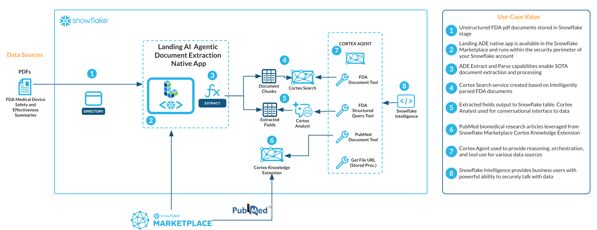

# landingai-ade-medical-device-agent
Use LandingAI Agentic Document Extraction with Snowflake Cortex Agents and Snowflake Intelligence

## Overall Solution

Here’s how the workflow looks in Snowflake, with everything happening in Snowflake:

1. Load unstructured FDA documents loaded into a Snowflake Stage
2. Leverage the LandingAI Agentic Document Extraction Native Application directly in Snowflake ensuring all processing happens in the customer’s Snowflake account for security and governance purposes
3. LandingAI Agentic Document Extraction Native Application extracts structured contents and performs document parsing all in a single call
4. Full parsed document contents including visual ground information are further processed and included in Cortex Search to be used for downstream retrieval augmented generation (RAG) purposes
5. Extracted structured contents are included in Snowflake tables, allowing for downstream business analytics, including for Cortex Analyst, which allows text-to-SQL capabilities
6. To enrich the solution, PubMed research articles available on the Snowflake marketplace as a Cortex Knowledge Extension, provides a RAG-ready Cortex Search service
7. An Agent using Cortex Agents is provided with various tools to provide an agentic approach to handle complex questions about the documents. This includes leveraging the agent’s reasoning and orchestration capabilities to call the above Cortex Search, Cortex Analyst, PubMed Cortex Knowledge Extension tools.
8. Snowflake Intelligence provides a business-user friendly view to interact with these documents using the above Cortex Agent.

## References and links

[Agentic Document Extraction | AI Document Intelligence by LandingAI](https://landing.ai/agentic-document-extraction)
[Cortex Search | Snowflake Documentation](https://docs.snowflake.com/en/user-guide/snowflake-cortex/cortex-search/cortex-search-overview)
[Cortex Analyst | Snowflake Documentation](https://docs.snowflake.com/en/user-guide/snowflake-cortex/cortex-analyst)
[Cortex Agents | Snowflake Documentation](https://docs.snowflake.com/en/user-guide/snowflake-cortex/cortex-agents)
[Cortex Knowledge Extensions | Snowflake Documentation](https://docs.snowflake.com/en/user-guide/snowflake-cortex/cortex-knowledge-extensions/cke-overview)

[Overview of Snowflake Intelligence](https://docs.snowflake.com/en/user-guide/snowflake-cortex/snowflake-intelligence)
[PubMed](https://dailymed.nlm.nih.gov/)

Source: U.S. Food & Drug Administration (FDA) device approval packages (Summaries of Safety and Effectiveness Data). All documents are publicly available through https://www.accessdata.fda.gov/scripts/cdrh/cfdocs/cfpcd/classification.cfm
The FDA does not endorse this analysis or solution.
